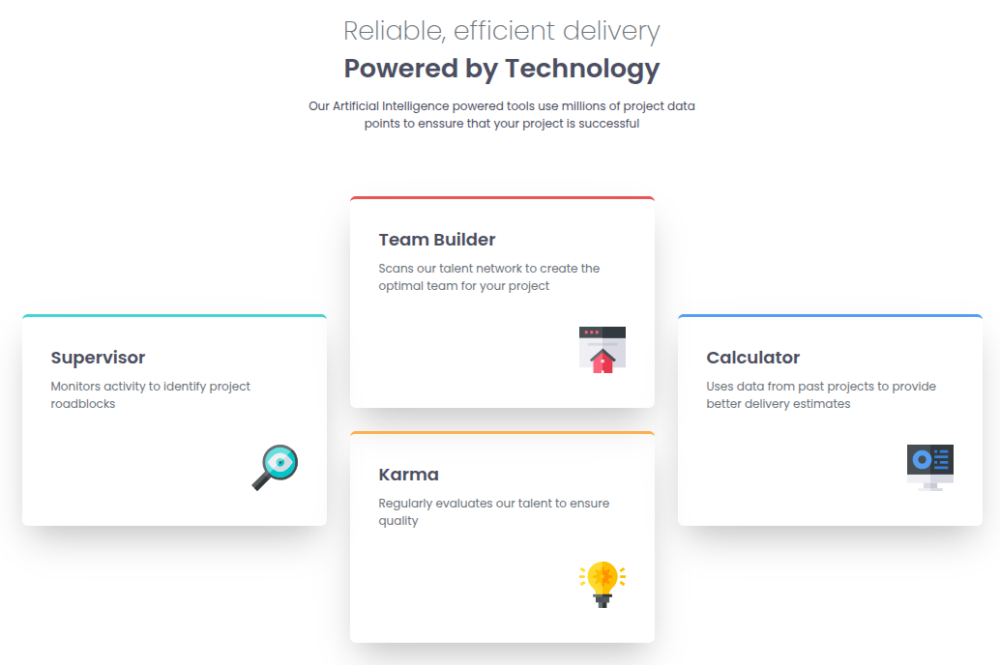
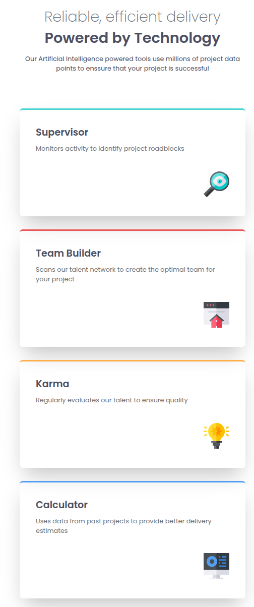

# Frontend Mentor - Four card feature section solution

This is a solution to the [Four card feature section challenge on Frontend Mentor](https://www.frontendmentor.io/challenges/four-card-feature-section-weK1eFYK). Frontend Mentor challenges help you improve your coding skills by building realistic projects. 

## Table of contents

- [Overview](#overview)
  - [The challenge](#the-challenge)
  - [Screenshot](#screenshot)
  - [Links](#links)
- [My process](#my-process)
  - [Built with](#built-with)
  - [What I learned](#what-i-learned)
- [Author](#author)

## Overview

### The challenge

Users should be able to:

- View the optimal layout for the site depending on their device's screen size

### Screenshot





### Links

- [Github Repository](https://github.com/ffrosch/frontendmentor-four-card-feature-selection)
- [Live URL](https://ffrosch.github.io/frontendmentor-four-card-feature-selection/)

## My process

### Initial setup

Install dependencies

```shell
bun create vite my-project --template vue
cd my-project
bun install
bun install tailwindcss
bun install -d @tailwindcss/vite @vue/tsconfig
bun install --peer typescript
```

Adjust `vite.config.js` to this

```ts
import { defineConfig } from "vite";
import vue from "@vitejs/plugin-vue";
import tailwindcss from "@tailwindcss/vite";

// https://vite.dev/config/
export default defineConfig({
  resolve: {
    alias: {
      "@": "/src",
    },
  },
  base: '/<project-name>/',
  plugins: [
    vue(),
    tailwindcss()
  ],
});
```

Add fonts and tailwind to `src/style.css`

```css
@import url("https://fonts.googleapis.com/css2?family=Poppins:wght@200;400;600&display=swap");
@import "tailwindcss";
```

Add this to `package.json`

```json
{
    "scripts": {
        "dev": "bunx --bun vite",
        "build": "bunx --bun vite build",
        "preview": "bunx --bun vite preview"
    }
}
```

Create a `tsconfig.json`

```json
{
  "extends": "@vue/tsconfig/tsconfig.json",
  "compilerOptions": {
    "baseUrl": ".",
    "paths": {
      "@/*": ["src/*"]
    }
  },
  "include": [
    "src/**/*.ts",
    "src/**/*.d.ts",
    "src/**/*.tsx",
    "src/**/*.vue",
  ],
}
```

### Built with

Tech Stack: Bun, Vite, Vue, Typescript, Tailwind

- Mobile-first workflow
- Flexbox
- Tailwind custom theme
- [Vue](https://vuejs.org/) - JS library
- [Vite](https://vite.dev/) - Build tool
- [Typescript](https://www.typescriptlang.org/) - Type Safety
- [Tailwind](https://tailwindcss.com/) - CSS framework

### What I learned

Tailwind 4 combined with the "Tailwind CSS Intellisense" extension for VS Code makes styling and creating custom utility classes a breeze. Such a delight!
Using Bun and Vue for such a small project is overkill for sure, but it's great to get more practice in quickly setting up a development environment.

This project really helped me to get more experience with CSS Grid.

## Author

- Website - [florianfrosch.de](https://florianfrosch.de/)
- Frontend Mentor - [@ffrosch](https://www.frontendmentor.io/profile/ffrosch)

## Acknowledgments

Fade-In Animation inspired by: https://fluffykas.github.io/four-card-feature-section/